# 一、分布式系统概述

## 什么是分布式系统  

分布式系统是若干独立计算机的集合， 它们对于用户来说就像一个系统。

分布式系统屏蔽系统中种类各异的计算机和网络， 常常通过一个软件层（中间件） 组织起来。  

## 哪两项技术领域的进步产生了分布式系统

- 高性能微处理器的开发  
- 高速计算机网络的发明  

## 分布式系统中透明性的种类、 定义 

| 透明性 | 描述                                   |
| ------ | -------------------------------------- |
| 访问   | 隐藏数据表示形式以及访问方式的不同     |
| 位置   | 隐藏数据所在位置                       |
| 迁移   | 隐藏资源是否已移动到另一个位置         |
| 重定位 | 隐藏资源是否在使用中已移动到另一个位置 |
| 复制   | 隐藏资源是否已被复制                   |
| 并发   | 隐藏资源是否由若干相互竞争的用户共享   |
| 故障   | 隐藏资源的故障和恢复                   |
| 持久性 | 隐藏资源（软件） 位于内存里或在磁盘上  |

## 分布式系统中的扩展技术有哪些？

### 分布式系统的可扩展性 

- 规模上的扩展： 更多的用户和资源

- 地域上的扩展： 用户和资源相隔更远

- 管理上的扩展： 跨越多个管理机构

### 扩展技术

1. 隐藏通信等待时间：异步通信  、减少通信量  
2. 分布技术： 分割组件， 分散到系统中， 如DNS和WWW
3. 复制技术: 多拷贝  

## 分布式系统的类型有哪三种  

- 分布式计算系统
  - 集群计算系统
  - 网格计算系统

- 分布式信息系统
  - 事务处理系统  
  - 企业应用集成  
- 分布式普适系统


# 二、体系结构

## 什么是客户端-服务器模型  

- 服务器（server）：实现某个特定服务的进程  
- 客户（client）：向服务器请求服务的进程  
- 客户端-服务器之间的一般交互：请求/回复  
- 无连接的协议：高效，受传输故障的影响，适合局域网  
- 基于连接的协议：性能相对较低，适合广域网（TCP/IP）  

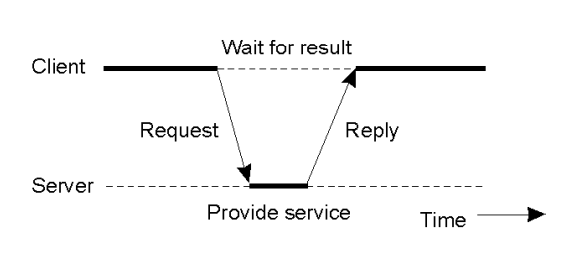

## 习题


# 三、分布式进程管理

## 多线程服务器的优点  

使用多线程的优点：

- 在某线程阻塞时，其他线程可以继续工作
- 利用多处理器，并行工作
- 缩短IPC通信的时间
- 出于软件工程的考虑:字处理程序(用户输入、拼写检查、语法检查、文档布局)

## 代码迁移的动机有哪些  

- 实现负载均衡  
  - 将进程从负载重的系统迁移到负载轻的系统，从而改善整体性能
- 改善通信性能  
  - 交互密集的进程可迁移到同一个节点执行以减少通信开销  
  - 当进程要处理的数据量较大时，最好将进程迁移到数据所在的节点

## 进程对资源的绑定类型有哪些  

按标志符（URL）、按值和按类型  

## 资源对机器的绑定类型有哪些  

未连接（数据文件）、附着连接（数据库）和紧固连接（本地设备

## 超载者启动的分布式启发式算法

算法描述  ：

``` markdown
当一个进程创建时，若创建该进程的机器发现自己超载，就将询问消息发送给一个随机选择的机器，询问该机器的负载是否低于一个阀值。
1. 如果是，那么该进程就被传送到该机器上去运行。
2. 否则，就再随机地选择一台机器进行询问。
这个过程最多执行N次，若仍然找不到一台合适的机器，那么算法将终止，新创建的进程就在创建它的机器上运行。
```

算法分析：

- 每一个机器都不断地向其他机器发送询问消息以便找到一台机器愿意接收外来的工作。
- 在这种情况下，所有机器的负载都很重，没有一台机器能够接收其它机器的工作，所以，大量的询问消息不仅毫无意义，而且还给系统增添了巨大的额外开销。

## 欠载者启动的分布式启发式算法

算法描述：

``` markdown
在这个算法中，当一个进程结束时，系统就检查自
己是否欠载。

- 如果是，它就随机地向一台机器发送询问消息。
- 如果被询问的机器也欠载，则再随机地向第二台、第三台机器发送询问消息。
- 如果连续N个询问之后仍然没有找到超载的机器，就暂时停止询问的发送，开始处理本地进程就绪队列中的一个等待进程，处理完毕后，再开始新一轮的询问。
- 如果既没有本地工作也没有外来的工作，这台机器就进入空闲状态。
- 在一定的时间间隔以后，它又开始随机地询问远程机器。
```

算法分析：

- 当系统繁忙时，一台机器欠载的可能性很小。即使有机器欠载，它也能很快地找到外来的工作。
- 在系统几乎无事可做时，算法会让每一台空闲机器都不间断地发送询问消息去寻找其它超载机器上的工作，造成大量的系统额外开销。
- 但是，在系统欠载时产生大量额外开销要比在系统过载时产生大量额外开销好得多。

## “上升-下降” (up-down)处理机分配算法

一个不需要预先知道所有信息的集中式启发式算法: “上升-下降” (up-down)算法

``` markdown
1. 由一个协调器来维护一张使用情况表
	- 每个工作站在表中都对应着一项（初始值为零）
	- 当发生一个重要事件时，就给协调器发送一个消息来更新使用情况表
2. 协调器根据使用情况表来分配处理机
	- 分配时机：调度事件发生时
	- 典型的调度事件：
		• 申请处理机
        • 处理机进入空闲状态
        • 发生时钟中断
```

## 习题

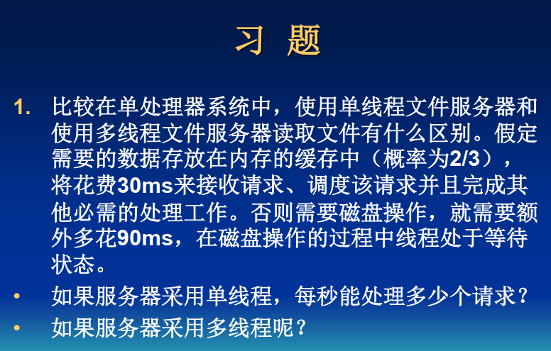


# 四、分布式系统通信

## 什么是远程过程调用？ 远程过程调用的步骤。  

远程过程调用（Remote Procedure Call, RPC）是分布式系统通信处理的事实标准，实现消息传输的透明性。

远程过程调用步骤：

``` markdown
1. 客户过程以正常的方式调用客户存根
2. 客户存根生成一个消息，然后调用本地操作系统
3. 客户端操作系统将消息发送给远程操作系统
4. 远程操作系统将消息交给服务器存根
5. 服务器存根将参数提取出来，然后调用服务器
6. 服务器执行要求的操作，操作完成后将结果返回给服务器存根
7. 服务器存根将结果打包成一个消息，然后调用本地操作系统
8. 服务器操作系统将含有结果的消息发送回客户端操作系统
9. 客户端操作系统将消息交给客户存根
10. 客户存根将结果从消息中提取出来，返回给调用它的客户过程
```

## 消息持久通信与暂时通信的区别  

暂时通信：不提供消息的中介存储，实时性要求高（几秒甚至几毫秒）  

持久通信：提供消息的中介存储，实时性要求低（几分钟）  

## 消息同步通信与异步通信的区别  

异步通信特征在于发送者要把传输的消息提交之后立即执行其他的程序， 这意味着该消息存储在位于发送端主机的本地缓冲区里中， 或者存储在送达的第一个通信服务器上的缓冲区上中。

而对于同步通信来说， 发送者在提交信息之后会被阻塞直到消息已经到达并储存在接收主机的本地缓冲区中以后也就是消息确实已经传到接收者之后， 才会继续执行其他程序。

## 多播通信： 反熵和gossiping  

### 多播

服务器向其他N台服务器发送更新时，底层的网络负责向多个接收者发送一个消息，高效

### 基于gossiping的数据通信

Epidemic协议使用本地信息在大型节点集中快速地传播信息  

提供最终一致性：保证所有的副本最终是一致的  

一个服务器可以是：

- 传染性的：持有愿意向其他服务器散布的更新
- 易感的：尚未更新的服务器
- 隔离的：已更新的服务器如果不愿意或不能扩散其更新

### 反熵传播模型

服务器P周期的随机选取一台服务器Q交换更新，方式包括：  

- P只把自己的更新推入Q：较差的选择？  
- P只从Q拉出新的更新  
- P和Q相互发送更新  
- 可以证明：如果初始只有一台服务器具有传染性，无论采用哪种形式，更新最终将被传播到所有服务器上： O(log(N)), N为系统结点数

### Gossiping模型  

思想：  

- 如果服务器P刚刚因为数据项x而被更新，那么它联系任意一个其他服务器Q，并试图将更新推入Q。
- 如果Q已经被其他服务器更新了， P可能会失去继续扩散的兴趣，变成隔离的（这种可能性是1/k）

评价：快速传播更新的方法  ，但不能保证所有的服务器都被更新了  。

s=e^-(k+1)(1-s)^,k=3时， s小于2%； k=4时， s小于0.7%

## 根据图片， 判断消息通信的类型  

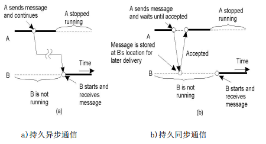

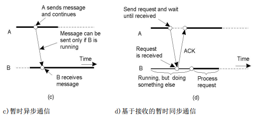

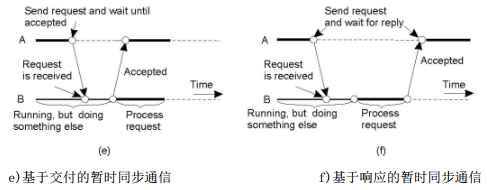

# 五、命名

## 移动实体定位的方法有哪些  

1. 广播和多播
   1. 广播： (可提供多播的网络)主机将包含该实体标示符的消息广播到每台机器上， 并且请求每台机器查看是否拥有该实体。 只有能够为该实体提供访问点的机器才会发送回复消息， 回复消息中包含访问点的地址。
   2. 多播： (点对点网络使用)主机向一个多播地址发送消息， 会发送给该多播组中的所有成员。

2. 转发指针： 当实体从 A 移动到 B 时， 它将在后面留下一个指针， 这个指针指向它在 B 中的新位置。 一旦查找到实体， 客户可顺着转发指针形成的链来查找实体的当前地址。

3. 基于起始位置的方法： 客户必须与起始位置联系， 起始位置返回客户所要查找的主机的地址。

4. 分布式散列表。

5. 分层方法： 见 下一节。

## 描述分层方法中查找一实体的过程  

1. 希望定位实体 E 的客户向它所在的叶域 D 的目录节点发送了一个查找请求
2. 如果叶域 D 的目录节点中没有存储该实体的位置记录， 那么就说明该实体现在不在 D 中。 因此这个节点会把请求转发给它的父节点。
3. 如果父节点也没有 E 的位置记录， 那么就会把查找请求转发给更高一层的域， 依次类推
4. 如果节点 M 存储了 E 的位置记录， 那么一旦请求到达 M 后， 就可以知道 E 位于节点 M 代表的域中， M 存储了一条位置记录， 其中包含了一个指向其子域的指针
5. 然后 M 就把请求转发给那个子域的目录节点， 那个子域会依次向树的下方转发请求， 直到请求最终到达叶节点为止。 存储在叶节点的位置记录会包含 E 在哪一个叶域中的地址。
6. 将该地址返回给发送请求的客户。

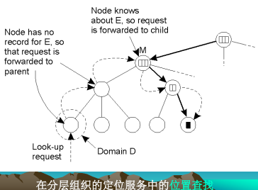


## 描述分层方法中插入一实体的过程

1. 实体 E 在叶域 D 中创建了一个复制实体， 需要在这个复制实体中插入 E 的地址。 插入操作从 D 的叶节点开始， 然后 D 会立即把插入请求转发给它的父节点。
2. 父节点也转发插入请求， 直到插入请求到达已经为 E 存储了位置记录的目录节点 M 为止。
3. 节点 M 在 E 的位置记录中存储了一个指针， 这个指针指向转发插入请求的那个子节点， 该子节点会建立一条关于 E 的位置记录， 这条位置记录中包含一个指针， 该指针指向转发请求的下一层节点。 这个过程会连续进行，直到到达发起请求的叶节点为止。
4. 最后， 那个叶节点会建立一条记录， 这条记录包含实体在关联叶域中的位置。

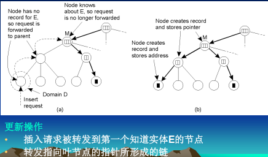

## 习题


# 六、同步

## Lamport 时间戳算法的思想  

时间戳（ Time-Stamping）的算法：  


- 网络上的每个系统（站点）维护一个计数器，起时钟的作用
- 每个站点有一个数字型标识,消息的格式为（m,T~i~,i） ,m为消息内容， T~i~为时间戳， i为站点标识
- 当系统发送消息时，将时钟加一  
- 当系统j接收消息时，将它的时钟设为当前值和到达的时间戳这两者的最大者加一
- 在每个站点，时间的排序遵循以下规则 :

  - 对来自站点i的消息x和站点j的消息y,如果  

    - T~i~<T~j~或
    - T~i~=T~j~，且i<j

  - 则说消息x早于消息y  


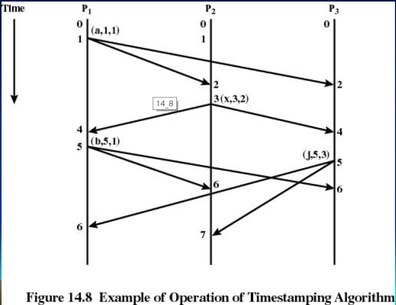

## 选举算法中Bully算法的思想  

当进程P注意到需要选举一个进程作协调者时：  

- 向所有进程号比它高的进程发ELECTION消息  

- 如果得不到任何进程的响应，进程P获胜，成为协调者
- 如果有进程号比它高的进程响应，该进程接管选举过程，进程P任务完成
- 当其他进程都放弃，只剩一个进程时，该进程成为协调者
- 一个以前被中止的进程恢复后也有选举权  

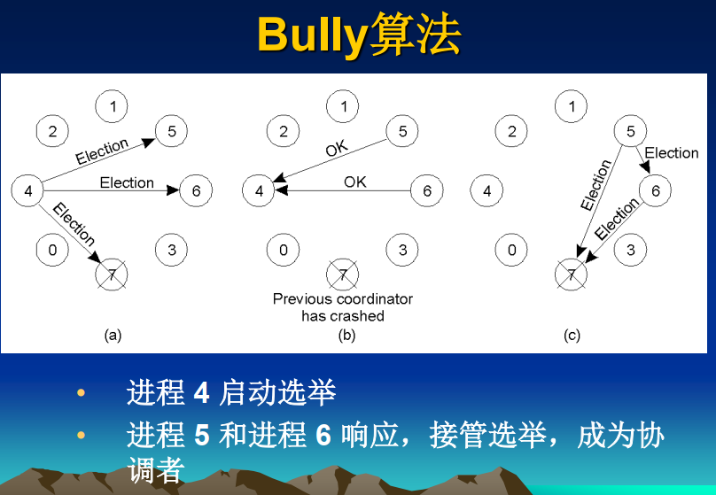

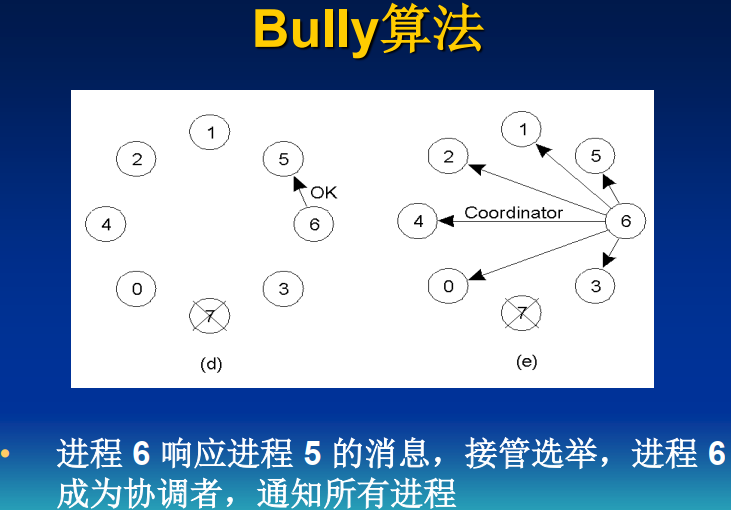

## 选举算法中环算法的思想  

不使用令牌， 按进程号排序， 每个进程都知道自己的后继者， 当进程 P 注意到需要选举一个进程作协调者时：

(1)创建一条包含该进程号的 ELECTION 消息， 发给后继进程

(2)后继进程再将自己的进程号加入 ELECTION 消息， 依次类推

(3)最后回到进程 P， 它再发送一条 COORDINATOR 消息到环上， 包含新选出的协调者进程（ 进程号最大者）和所有在线进程， 这消息在循环一周后被删除， 随后每个进程都恢复原来的工作。

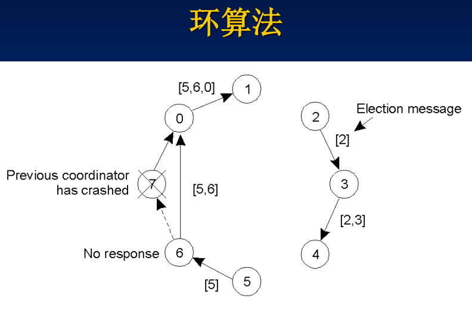

## 实现事务的方法  

1. 私有工作空间：

   1. 为进程提供一个私有工作空间，包含进程要访问的所有对象
   2. 进程的读写操作在私有工作空间进行，而不对实际的文件系统进行
   3. 开销大，可以进行优化使之可行  
      1. 读操作不复制  
      2. 写操作时复制  

   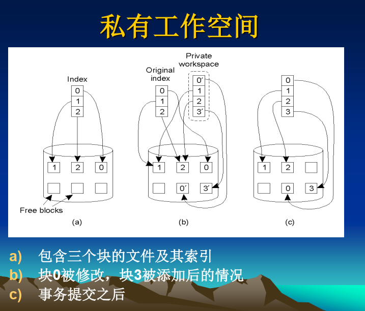

   如果事务中止，私有工作空间被释放，指向的私有块被删除

   如果事务提交，私有索引被移到父辈空间，不再被访问的块被释放掉

2. 写前日志（writeahead log）：先写日志，再做实际修改

   1. 日志内容：哪个事务在对文件进行修改，哪个文件和数据被改动，新值和旧值是什么等。
   2. 日志写入后，改动才被写入文件  
   3. 若事务中止，使用写前日志回退到原来的状态 
   4. 借助稳定存储器中的写前日志：当系统崩溃后，完成事务或取消事务 

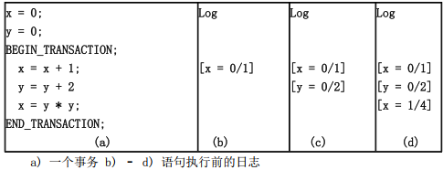

## 分布式的死锁检测Chandy-Misra-Haas算法的思想

Chandy-Misra-Haas 算法允许进程一次请求多个资源（ 如锁） 而不是一次一个。 通过允许多个请求同时进行使得事务的增长阶段加速。 这使得一个进程可以同时等待两个或多个进程。  

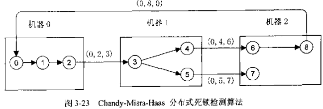

机器 1 上的进程 3 正在等待两个资源， 一个由进程 4 占有， 一个由进程 5 占有。 一些进程正在等待本地资源，例如进程 1。 一些进程， 如进程 2 在等待其他机器上的资源。  

当某个进程等待资源时， 例如 P0 等待 P1， 将调用 Chandy-Misra-Haas 算法。 生成一个探测消息并发送给占用资源的进程。 消息由三个数字构成： 阻塞的进程， 发送消息的进程， 接受消息的进程。 由 P0 到 P1 的初始消息包含三元组（ 0， 0， 1） 。 消息到达后， 接受者检查以确认它自己是否也在等待其他进程。 若是， 就更新消息，字段 1 保持不变， 字段 2 改成当前进程号， 字段 3 改为等待的进程号。 然后消息接着被发送到等待的进程。 若存在多个等待进程， 就要发送多个不同的消息。  


不论资源在本地还是在远程， 该算法一直继续下去。 图中（ 0， 2， 3） ， （ 0， 4， 6） ， （ 0， 5， 7） 和（ 0， 8， 0） 都是远程消息。 若消息转了一圈后又回到最初的发送者， 即字段 1 所列的进程， 就说明存在一个有死锁的环路系统。  

## 习题


# 七、一致性和复制

## 复制的目的和代价 

目的： 提高可靠性和提高性能。  

代价：

 (1)引起服务器数量扩展以及地理区域扩展， 那么在一致性上的代价就高了。

(2)网络通信开销。

(3)强一致性导致要求的原子操作很难快速完成。

(解决办法： 放宽一致性方面的限制， 放宽程度取决于复制数据的访问和更新模式以及数据的用途。 )  

## 能区分是否符合严格一致性、 顺序一致性、 因果一致性和FIFO 一致性

共享数据读操作和写操作时的一致性问题： 一致性模型实质上是进程和数据存储间的约定， 如果进程同意遵守某些规则， 数据存储将正常进行。 正常情况下， 进程的读操作应该返回最后一次写操作的结果。 没有全局时钟， 精确定义哪次写操作是最后一次写操作是困难的。 作为全局时钟的替代， 产生了一系列一致性模型， 每种模型都有效地限制了一个数据项上执行一次读操作所应返回的值。  

1. 严格一致性： 任何对数据项 X 的读操作将返回最近一次对 X 进行写操作的值。 对所有进程来说， 所有写操作都是瞬间可见的， 系统维护着一个绝对的全局时间顺序。  

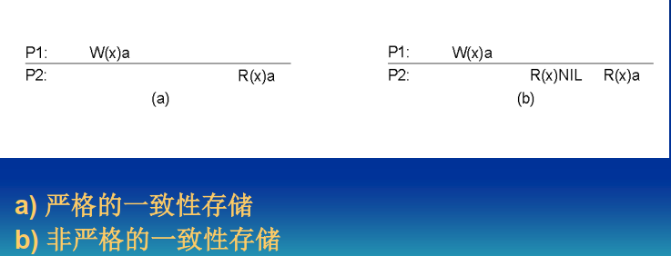

2. 顺序一致性：

   顺序一致性对存储器的限制比严格一致性要弱一些， 要满足以下的条件： 

   	1. 每个进程的内部操作顺序是确定不变的； 
   	1.  假如所有的进程都对某一个存储单元执行操作， 那么， 它们的操作顺序是确定的， 即任一进程都可以感知到这些进程同样的操作顺序。

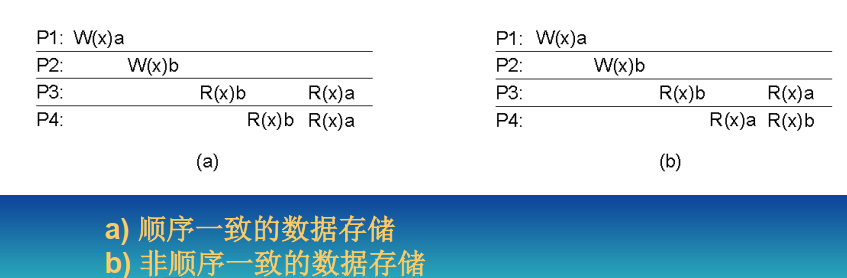

3. 因果一致性： 所有进程必须以相同的顺序看到具有潜在因果关系的写操作， 不同机器上的进程可以以不同的顺序看到并发的写操作。 

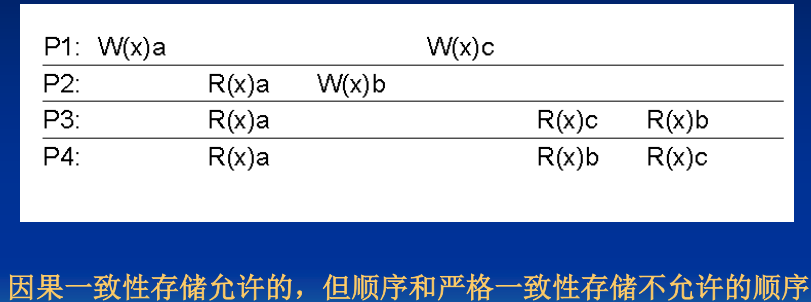

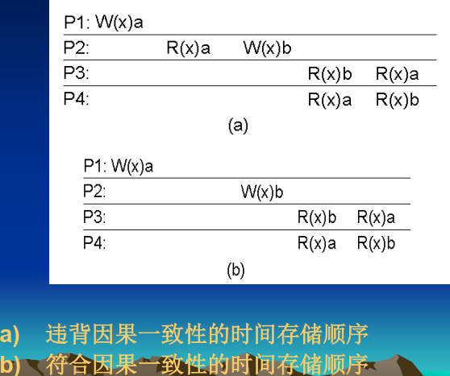

4. FIFO 一致性模型： 是在因果一致性模型上的进一步弱化， 它满足下面的条件：由某一个进程完成的写操作可以被其他所有的进程按照顺序感知到， 而从不同进程中来的写操作对不同的进程可以有不同的顺序。 一致性表现在要求任何位置都可以按顺序看到某个单一进程的写操作。

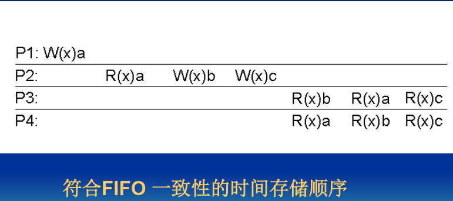

## 能区分是否符合单调读、 单调写、 写后读和读后写。

1. 单调读： 如果一个进程读取数据项 x 的值， 那么该进程对 x 执行的任何后续读操作将总是得到第一次读取的那个值或更新的值。

进程 P 对同一数据存储的两个不同本地备份执行的读操作  

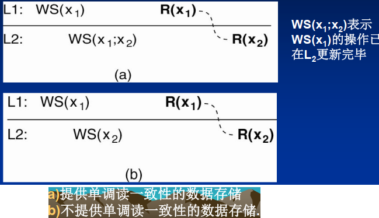


2. 单调写： 如果一个进程对数据项 x 执行的写操作必须在该进程对 x 执行的任何后续写操作之前完成。进程 P 对同一数据存储的两个不同本地备份执行的写操作， 类似以数据为中心的 FIFO 一致性  

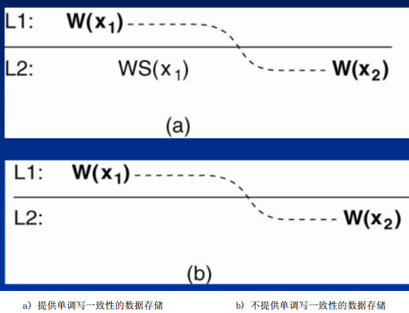

3. 写后读： 一个进程对数据项 x 执行的写操作结果总会被该进程对 x 执行的任何后续读操作看见。 这个一致性保证，写操作的结果可以被所有的后续读操作看到。  

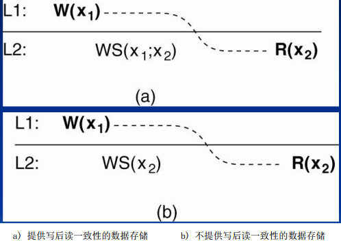


4. 读后写： 同一个进程对数据项 x 执行的读操作之后的写操作， 保证发生在与 x 读取之相同或更新的值上。

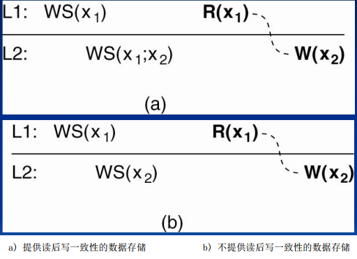


## 基于主备份的协议： 远程写协议、 本地写协议  

### 基于主备份的远程写协议：

（1） 所有读操作和写操作都被转发到一个固定的远程服务器上。 (如下图) 

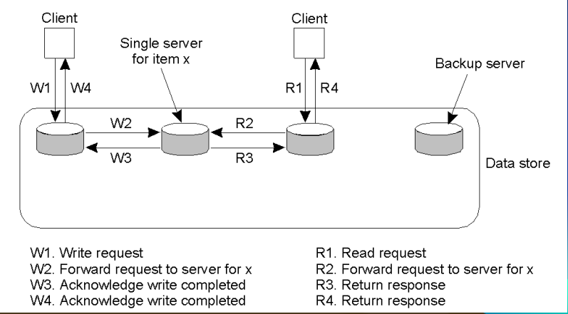

（2） 从一致性角度看， 主机备份协议允许进程在本地可用的副本上执行读操作， 但必须向一个固定的主拷贝上转发写操作的协议。 (如下图)

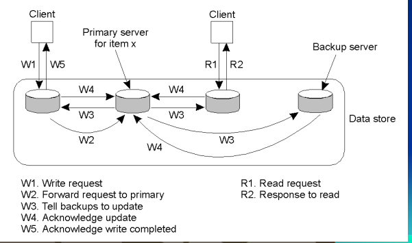

### 基于主备份的本地写协议：  

（ 1） 每个数据项都只有一个单一拷贝， 每当一个进程要在某个数据项上执行操作时， 先将那个数据项的单一拷贝传送到这个进程， 然后在执行相应操作。 (如下图) 

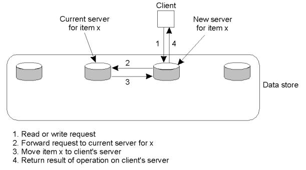

（ 2） 主机备份的本地写协议， 多个连续的写操作可在本地进行， 而读操作的进程还可以访问它们的本地拷贝，其中主备份移动到要执行更新的进程那里， 并且支持离线操作。 (如下图)  

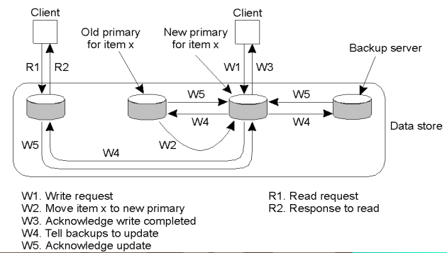

## 复制的写协议： 主动复制、 基于法定数目的协议  

### 主动复制： 

写操作可以在多个副本上执行， 每个副本对应一个进程， 该进程执行更新操作.

潜在问题：写操作导致更新传播， 操作需要在各地按相同顺序进行， 时间戳和定序器来实现。 

## 基于法定数目的协议  :

要求客户在读或写一个复制的数据项之前向多个服务器提出请求， 并获得他们的许可。 与前边的主动复制的差异在于， 主动复制要将更新传递到所有的复本上去。  

Gifford方法：客户在读写一个复制的数据时，先向多个服务器提出请求，获得许可;

读团体N~R~和写团体N~W~, N个副本

N~R~+N~W~>N; N~W~>N/2

表决算法的三个实例

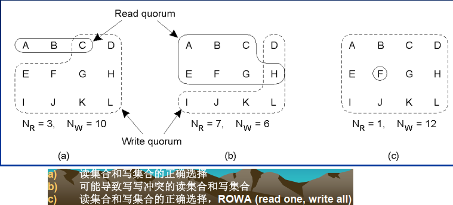


## 习题


# 八、容错性


## 什么叫容错性  

容错意味着系统即使发生故障也能提供服务，容错与可靠性相联系，包含以下需求：
可用性（Availability）：任何给定的时刻都能及时工作
可靠性（Reliability）：系统可以无故障的持续运行
安全性（Safety）：系统偶然出现故障能正常操作而不会造成任何灾难
可维护性（Maintainability）：发生故障的系统被恢复的难易程度

## 拜占庭将军问题  

Lamport 证明在具有 m 个故障进程的系统中， 只有存在 2m+1 的正常工作的进程才能达成协议， 即总进程为 3m+1。三个忠诚将军和一个叛徒的问题， 叛徒通过发送错误和矛盾来组织忠诚将军达成协议。 如下图： 假设现在将军们要相互告知自己的兵力， 将军三是叛徒。 每个人都将自己收到的向量发给其他所有的将军。


这个时候， 将军们把自己收到的向量中， 哪一个数出现得最多就把他纪录到自己的向量中去， 因此将军 124 都可以看到相同的消息： （ 1,2， UNKNOWN， 4） 。 但是如果有两个忠诚将军和一个叛徒将军， 就不能判断了。 如下图  ：


1、 2 得到的信息都没有出现大多数情况， 所以， 该算法不能产生协定。  

## 什么叫原子多播  

在分布式系统中经常需要保证消息要么被发送给所有的进程， 要么一个也不发送。通常还需要所有的消息都按相同的顺序发送给所有的进程。 这种方式称为原子多播。

原子多播确保没有故障的进程对数据库保持一致； 当一个副本从故障中恢复并重新加入组时， 原子多播强制它与其他组成员保持一致。

原子多播=虚拟同步+消息排序  

### 虚拟同步：

保证多播到组视图的消息被传送给组中的每个正常进程，如果发送消息的进程在多播期间失败，则消息或者传递给剩余的所有消息，或者被每个进程忽略。具有这种属性的可靠多播称为虚拟同步。所有多播都在视图改变之间进行

### 消息排序：

（1）可靠不排序的多播：对接收不同进程发送的消息的次序不做任何保证
（2）FIFO 顺序的多播：按照消息发送的顺序传送同一进程的消息，对不同进程发送的消息的传送顺序没有约束
（3）按因果关系排序的多播：按因果关系排序多播来保留消息间的因果关系
（4）全序多播：无论消息传送是无序、 FIFO 顺序还是按因果关系排序，对所有的组成员按相同的次序传送提供了全序的消息传送的虚拟同步可靠多播称为原子多播

## 分布式提交—两阶段提交的思想  

在两段提交协议中， 将提交分成两个阶段。

第一阶段（表决阶段），事务的协调者询问各个参与者是否可以提交，此时，各个参与者将回答消息发给协调者。协调者根据收到的消息，看是否可以真正提交。

第二阶段（完成阶段），如果可以提交，则通知各参与者立即执行提交，否则，通知它们中止此事务。  

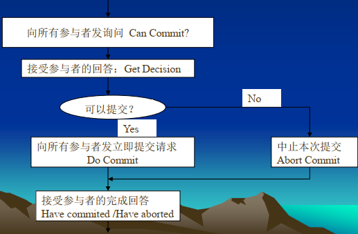

 每个阶段有两步（1）（2） 属于第一阶段（3）（4）属于第二阶段：  

（1）协调者向所有的参与者发送一个 VOTE_REQUEST 消息。  

（2）当参与者收到 VOTE_REQUEST 消息时， 就向协调者返回一个 VOTE_COMMIT 消息通知协调者它已经准备好本地提交事务中属于它的部分， 否则返回一个 VOTE_ABORT 消息 

（3）协调者收集来自参与者的所有选票。 如果所有的参与者都表决提交， 那么就向所有的参与者发送一个GLOBAL_COMMIT 消息， 如果有一个参与者表决取消， 协调者决定取消事务并多播一个 GLOBAL_ABORT 消息。

（4）每个提交表单的参与者等待协调者的最后反应。 如果参与者收到 GLOBAL_COMMIT 消息， 就在本地提交事务， 否则收到 GLOBAL_ABORT， 就在本地取消事务。

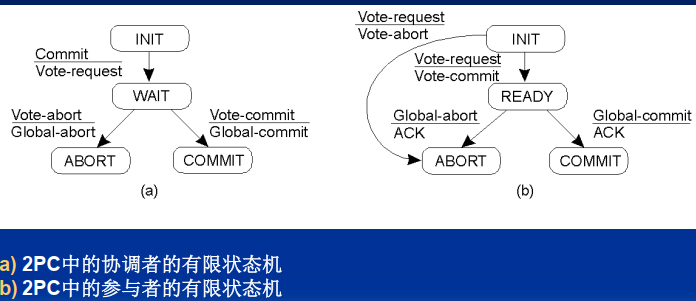

参与者一旦投票， 则失去自主能力， 必须等待协调者的最终决定， 可能造成阻塞可能的阻塞状态：

参与者在 INIT 状态等待协调者的 VOTE_REQUEST 消息;

协调者在 WAIT 状态等待来自每个参与者的表决;

参与者在 READY 状态等待协调者发送的全局表决消息;

## 习题

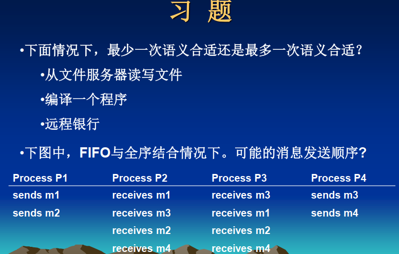

# 九、分布式安全

## 什么是机密性和完整性  

机密性:系统将信息只向授权用户公开  

完整性:对系统资源的更改只能以授权方式进行  

## 对称加密系统和公钥系统的区别  

对称加密系统： 加密与解密密钥相同， 即 P=D~k~(E~k~(P)),也称为共享密钥系统。

非对称加密系统： 加密与解密密钥不同(一个公开、 一个保密)， 但构成唯一的一对， 即 P=D~Kd~ (E~Ke~ (P)),也称为**公钥系统**。

后者在计算上更为复杂。 用 RSA 加密消息比 DES 慢大约 100-1000 倍。 所以一般用 RSA 以安全方式交换共享密钥，很少用它来实际加密“ 标准” 数据。

## 什么是安全通道  

使客户与服务器之间的通信保持安全，免受对消息的窃听、修改和伪造的攻击  

身份验证：通信双方需要验证身份

消息的完整性和机密性：消息未受到窃听、修改和伪造的攻击

## 阐述基于共享密钥的身份验证的思想  

见附件

## 阐述使用密钥发布中心的身份验证的思想  
